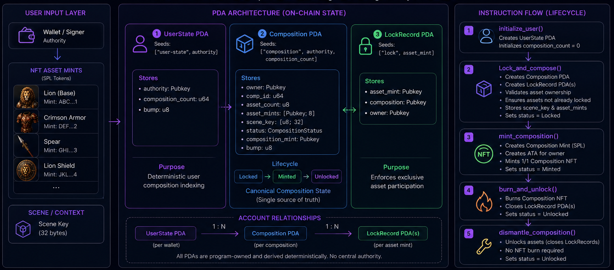
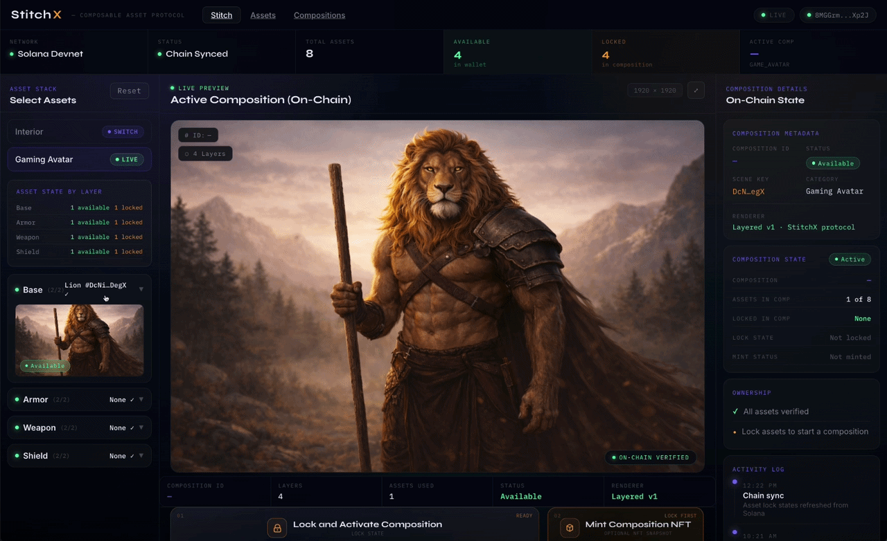

# StitchX — Composable Asset Protocol on Solana

> **Configure multiple NFTs into a single on-chain Composition. Snapshot it as a verified NFT. Recover your assets anytime.**

StitchX is a fully on-chain compositing protocol built with Anchor on Solana. It lets users lock multiple NFT assets into a canonical `Composition` account, enforce uniqueness through PDA-based `LockRecord` accounts, optionally export a verified snapshot NFT, and recover all assets via unlock or dismantle flows — all without any off-chain intermediary.

<!-- > **Built for the Colosseum Solana Hackathon** -->

---

## Demo & Pitch

| | |
|---|---|
| 🎬 **Demo Video** | [Watch on YouTube](https://www.youtube.com/watch?v=-edAscwarc8) |
| 🎤 **Founder Pitch** | [Watch on YouTube](https://www.youtube.com/watch?v=FJAG5AIXuDY) |
| 🔗 **Program ID** | [Gvob5UYJiC2EvqFW6xgyq15EEypp3YpFy2G1La6rctnC](https://explorer.solana.com/address/Gvob5UYJiC2EvqFW6xgyq15EEypp3YpFy2G1La6rctnC?cluster=devnet) (Solana Devnet) |
| 🖥️ **Frontend Repo** | [sidarth16/StitchX-Solana-Frontend](https://github.com/sidarth16/StitchX-Solana-Frontend) |
---

## Architecture Overview



The diagram above shows the full protocol in one view: the three PDA account types and their seeds, the account relationships (1:N UserState → Composition → LockRecord), the Composition status lifecycle (Locked → Minted → Unlocked), and the five on-chain instructions. Every account is program-owned and derived deterministically — no central authority.

---

## What Makes StitchX Different

Most NFT compositing projects treat the minted image as the product. StitchX treats the **on-chain Composition account** as the product.

| Common Approach | StitchX |
|---|---|
| Metadata update = protocol state | Composition PDA = canonical state |
| NFT drives unlock | Composition drives unlock |
| Assets can be reused | LockRecord PDA enforces uniqueness |
| Mutable after creation | Composition definition is immutable — assets recoverable only via dismantle or burn |
| Off-chain coordination | All state verified on-chain |

The NFT is intentionally secondary — a verifiable snapshot export. The protocol works completely without one.

---

## UI Preview



> Full walkthrough in the [demo video](https://www.youtube.com/watch?v=-edAscwarc8).

---

## Protocol Architecture

StitchX is three layers working together:

```
┌─────────────────────────────────────────────────────┐
│                   Frontend (Next.js)                │
│   Stitch editor · Assets page · Compositions page  │
│   Reads: UserState · Composition · LockRecord PDAs │
└────────────────────┬────────────────────────────────┘
                     │ Anchor client (useStitchX hook)
┌────────────────────▼────────────────────────────────┐
│              Anchor Program (Rust)                  │
│   stitchx_sid · Gvob5UYJiC2EvqFW6xgyq15EEypp3...  │
│   initialize_user · lock_and_compose               │
│   mint_composition · burn_and_unlock               │
│   dismantle_composition                            │
└────────────────────┬────────────────────────────────┘
                     │ CPI
┌────────────────────▼────────────────────────────────┐
│            Solana Runtime + SPL Token               │
│   Token account ownership checks                   │
│   Mint creation · ATA creation · Authority revoke  │
└─────────────────────────────────────────────────────┘
```

---

## On-Chain Data Model

### Account Layout

```
Wallet (Signer)
│
├── UserState PDA
│   seeds: ["user-state", wallet]
│   ├── authority: Pubkey
│   ├── composition_count: u64   ← deterministic composition IDs
│   └── bump: u8
│
├── Composition PDA (one per composition)
│   seeds: ["composition", wallet, comp_id_le_bytes]
│   ├── owner: Pubkey
│   ├── comp_id: u64
│   ├── asset_count: u8
│   ├── asset_mints: [Pubkey; 8]
│   ├── scene_key: [u8; 32]      ← context metadata, NOT a PDA seed
│   ├── status: Locked | Minted | Unlocked
│   ├── composition_mint: Pubkey ← zero if not yet minted
│   └── bump: u8
│
└── LockRecord PDA (one per locked asset)
    seeds: ["lock", asset_mint]
    ├── asset_mint: Pubkey
    ├── composition: Pubkey      ← which Composition holds this asset
    └── owner: Pubkey
```

### Why this layout works

The `LockRecord` PDA seed is derived from the asset mint address alone. That means any attempt to lock the same NFT into a second composition will fail deterministically — the program tries to create a PDA that already exists. No registry, no list scan, no off-chain check needed. The uniqueness guarantee is structural.

The `Composition` PDA is derived from the wallet and the composition counter. Because `composition_count` is only incremented after a successful lock, every composition gets a unique, gap-free ID. The PDA itself is the canonical proof of the composition.

---

## PDA Diagram

```
                        LOCK_RECORD PDA
                        ═══════════════
  ["lock", asset_mint_A] ──► LockRecord
                              asset_mint: A
                              composition: Comp PDA
                              owner: Wallet

  ["lock", asset_mint_B] ──► LockRecord
                              asset_mint: B
                              composition: Comp PDA
                              owner: Wallet

                        COMPOSITION PDA
                        ═══════════════
  ["composition",              ┌────────────────────────┐
   wallet,              ──────►│ Composition            │
   comp_id_bytes]              │ owner: Wallet          │
                               │ comp_id: 3             │
                               │ asset_mints: [A, B, …] │
                               │ scene_key: [u8; 32]    │
                               │ status: Locked         │
                               │ composition_mint: 0x0  │
                               └────────────────────────┘

                        USER STATE PDA
                        ══════════════
  ["user-state", wallet] ──► UserState
                              authority: Wallet
                              composition_count: 4
```

---

## Protocol Lifecycle

```
┌──────────────────────────────────────────────────────────────────────┐
│                       STITCHX PROTOCOL FLOW                         │
└──────────────────────────────────────────────────────────────────────┘

  1. INITIALIZE USER
  ──────────────────
  Wallet ──► initialize_user ──► Creates UserState PDA
                                  composition_count = 0

  2. LOCK AND COMPOSE
  ───────────────────
  Wallet selects NFTs

  For each asset:
    Program reads token account (must be wallet-owned, amount ≥ 1)
    Derives lock PDA: ["lock", asset_mint]
    Checks PDA doesn't exist  ← asset reuse prevention
    Creates LockRecord via invoke_signed

  Creates Composition PDA with all asset mints
  Sets status = Locked
  Increments composition_count

  3. (OPTIONAL) MINT COMPOSITION SNAPSHOT
  ────────────────────────────────────────
  Wallet ──► mint_composition
    Creates SPL mint (0 decimals)
    Creates owner ATA
    Mints exactly 1 token
    Revokes mint authority    ← supply is permanently 1
    Revokes freeze authority  ← fully permissionless
    Sets Composition.status = Minted
    Stores composition_mint address in Composition

    Client (browser) appends atomically:
      ├── Metaplex CreateMetadata (name, URI, attributes)
      ├── Metaplex CreateMasterEdition
      └── Verify collection (StitchX Compositions)

  4a. DISMANTLE COMPOSITION (primary path)
  ─────────────────────────────────────────
  Wallet ──► dismantle_composition
    Validates caller owns composition
    Validates status is Locked or Minted
    Closes each LockRecord (returns lamports to owner)
    Sets status = Unlocked

  4b. BURN AND UNLOCK (NFT-based path)
  ─────────────────────────────────────
  Wallet ──► burn_and_unlock
    Validates status is Minted
    Validates caller holds the composition NFT
    Burns 1 token from ATA
    Closes each LockRecord
    Sets status = Unlocked
```

---

## Instruction Reference

### `initialize_user`

Creates the `UserState` PDA for the calling wallet. Safe to call only once.

```
Accounts:
  authority     [mut, signer]
  user_state    [init, PDA: "user-state" + authority]
  system_program
```

### `lock_and_compose`

Locks 1–8 NFT assets and creates an immutable Composition.

```
Accounts:
  user_state    [mut, PDA validated]
  composition   [init, PDA: "composition" + authority + comp_id_le]
  authority     [mut, signer]
  system_program

Remaining accounts (strict order, pairs):
  tokenAccount0, lockRecord0
  tokenAccount1, lockRecord1
  ...

Parameters:
  scene_key: [u8; 32]     ← composition context label
  asset_mints: Vec<Pubkey> ← must match remaining account order
```

On-chain validation per asset:
- token account is owned by SPL Token program
- token account owner matches the signer
- token account mint matches the declared asset mint
- amount ≥ 1
- lock PDA does not already exist (anti-reuse)

### `mint_composition`

Creates a 1/1 snapshot NFT from the locked Composition.

```
Accounts:
  composition         [mut, PDA validated, must be Locked]
  owner               [mut, signer]
  composition_mint    [mut, signer, new keypair]
  owner_ata           [mut, derived ATA]
  token_program
  associated_token_program
  system_program
  rent
```

After this instruction returns, the client appends Metaplex metadata and master edition instructions atomically in the same transaction.

### `burn_and_unlock`

Burns the composition NFT and releases all locked assets.

```
Accounts:
  composition      [mut, PDA validated, must be Minted]
  owner            [mut, signer]
  composition_mint [mut, validated against composition]
  owner_ata        [mut, validated against mint]
  token_program

Remaining accounts:
  lockRecord0, lockRecord1, ...  (in composition asset order)
```

### `dismantle_composition`

Releases all locked assets without requiring the NFT. The primary unlock path.

```
Accounts:
  composition  [mut, PDA validated, Locked or Minted]
  owner        [mut, signer]

Remaining accounts:
  lockRecord0, lockRecord1, ...  (in composition asset order)
```

---

## Account Size Reference

```rust
UserState::LEN    = 8  + 32 + 8 + 1           = 49 bytes
                    disc  auth  count  bump

Composition::LEN  = 8  + 32 + 8 + 1 + (32*8) + 32 + 1 + 32 + 1
                  = 8  + 32 + 8 + 1 + 256    + 32 + 1 + 32 + 1
                  = 371 bytes
                    disc  own  id  cnt  mints  key  st  mint bmp

LockRecord::LEN   = 8  + 32 + 32 + 32         = 104 bytes
                    disc  mint  comp  owner
```

---

## Error Codes

| Error | Condition |
|---|---|
| `InvalidAssetCount` | Fewer than 1 or more than 8 assets in `lock_and_compose` |
| `CompositionAlreadyMinted` | Calling `mint_composition` on a non-Locked composition |
| `CompositionCountOverflow` | Wallet has exceeded u64 max compositions |
| `AssetAlreadyLocked` | Lock PDA already exists for a given asset mint |
| `InvalidState` | Account ownership, mint mismatch, or wrong composition state |
| `InvalidOwner` | Caller does not hold the composition NFT |

---

## Remaining Account Ordering — Why It Matters

The `lock_and_compose` instruction uses `remaining_accounts` to pass a variable number of asset pairs. The program processes them with `chunks_exact(2)`:

```rust
for (asset_mint, remaining_pair) in asset_mints
    .iter()
    .zip(ctx.remaining_accounts.chunks_exact(2))
{
    let token_account_info = &remaining_pair[0];  // index 0 = token account
    let lock_record_info   = &remaining_pair[1];  // index 1 = lock PDA
    ...
}
```

The client **must** pass `[tokenAccount0, lockRecord0, tokenAccount1, lockRecord1, ...]` in the exact order the asset mints are declared. A mismatch causes an `InvalidState` error. The tests harden this ordering and the frontend mirrors it exactly.

---

## Snapshot NFT Pipeline

The composition NFT is a Metaplex-compatible 1/1 token that snapshots the on-chain composition state.

```
Browser reads Composition account
    │
    ▼
Resolves each asset_mint through registry
    │
    ▼
Renders flattened PNG using runtime layer order
    │
    ▼
Server-side API uploads PNG to Pinata (IPFS)
    │
    ▼
Server-side API generates and uploads metadata JSON to Pinata
    │
    ▼
Browser builds single transaction:
  ├── Anchor: mintComposition (creates mint, ATA, mints 1 token)
  ├── Metaplex: CreateMetadataAccountV3
  │     name: "StitchX Composition #N"
  │     attributes: comp_id, scene_key, asset_count, asset labels, comp PDA
  ├── Metaplex: CreateMasterEditionV3
  ├── Metaplex: VerifySizedCollectionItem (StitchX Compositions)
  └── SPL: SetAuthority × 2 (revoke mint + freeze authority)
    │
    ▼
Single atomic transaction → Phantom signs → confirmed on-chain
```

Pinata secrets stay server-side only. The NFT URI resolves to the Pinata-hosted metadata JSON. The canonical composition state remains the on-chain PDA regardless of metadata hosting.

---

## Why the NFT Is Secondary — Not Just a Design Choice

This isn't aesthetic. It's a protocol invariant:

1. The `Composition` account stores the authoritative asset list. The NFT stores a human-readable snapshot. If the metadata URI or IPFS content changes, the composition does not.

2. `dismantle_composition` can unlock assets without any NFT. The composition can exist in `Locked` state permanently and be dismantled cleanly without ever minting a snapshot.

3. The NFT's `composition_pda` attribute lets any indexer or UI reconstruct the full composition state from chain at any time — the NFT points to the truth, it doesn't contain it.

4. Minting is a state transition (`Locked → Minted`), not a creation event. The assets are already locked and immutable before the NFT exists.

---

## Testing

StitchX uses LiteSVM integration tests that exercise the live program binary, not mocked account state.

```bash
NO_DNA=1 cargo test -p stitchx-sid --tests
```

### Covered flows

- initialize user
- lock and compose (1 asset, 4 assets)
- mint snapshot NFT
- burn and unlock
- dismantle composition (Locked state)
- dismantle composition (Minted state)

### Hardened edge cases

- double dismantle rejected
- invalid remaining account ordering rejected
- wrong lock PDA address rejected
- wrong token account owner rejected
- mint mismatch rejected
- asset reuse across compositions rejected (LockRecord already exists)

---

## Local Development

### Prerequisites

- Rust + Anchor CLI
- Solana CLI (configured for devnet or localnet)
- Node.js + Yarn
- A funded devnet wallet at `~/.config/solana/id.json`

### Install

```bash
yarn install
```

### Build the Anchor program

```bash
NO_DNA=1 anchor build
```

### Run all tests

```bash
NO_DNA=1 cargo test -p stitchx-sid --tests
```

### Run a full local lifecycle (localnet)

```bash
NO_DNA=1 ANCHOR_PROVIDER_URL=http://127.0.0.1:8899 \
ANCHOR_WALLET=~/.config/solana/id.json \
npx ts-node --transpile-only scripts/full-flow.ts
```

### Mint demo assets (devnet)

```bash
RPC_URL=https://api.devnet.solana.com \
WALLET_PATH=~/.config/solana/id.json \
RECIPIENT_WALLET=<recipient-wallet> \
npm run mint:demo-assets
```

### Mint interior assets (devnet)

```bash
RPC_URL=https://api.devnet.solana.com \
WALLET_PATH=~/.config/solana/id.json \
RECIPIENT_WALLET=<recipient-wallet> \
npm run mint:interior-assets
```

---

## Environment Variables

| Variable | Purpose |
|---|---|
| `RPC_URL` / `NEXT_PUBLIC_SOLANA_RPC_URL` | Solana RPC endpoint |
| `WALLET_PATH` | Path to keypair JSON for scripts |
| `RECIPIENT_WALLET` | Target wallet for demo asset minting |
| `PINATA_API_KEY` / `PINATA_API_SECRET` | Pinata credentials (server-side only) |

---

## Repository Layout

This repository contains the on-chain program and developer scripts only.

> **Frontend repo:** [sidarth16/StitchX-Solana-Frontend](https://github.com/sidarth16/StitchX-Solana-Frontend)

```
programs/
  stitchx-sid/
    src/lib.rs          ← entire on-chain program

scripts/
  full-flow.ts          ← end-to-end local lifecycle
  mint-demo-assets.ts   ← devnet asset minting
  mint-interior-assets.ts

README.md           ← this file
```

---


---

## What Was Built

StitchX is a working Solana protocol, not a rendering demo:

- An Anchor program with five instructions, three PDA account types, and structural uniqueness enforcement
- LiteSVM integration tests covering the full lifecycle and all known failure modes
- TypeScript scripts for local and devnet flows
- A Next.js frontend that reads all protocol state from chain and drives every action through Anchor transactions
- A server-side snapshot mint pipeline that atomically creates the SPL token, attaches Metaplex metadata, and verifies the collection
- Verified Metaplex NFTs deployed on Solana Devnet with on-chain composition attributes

The composition is always the source of truth. The NFT just lets the world see it.